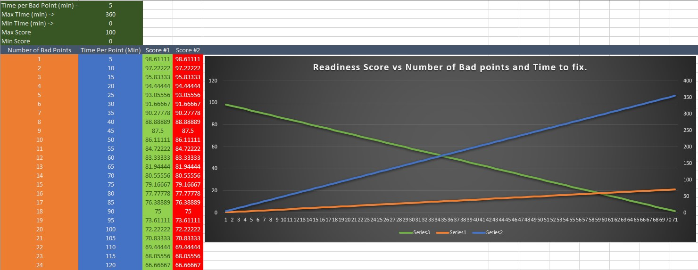

# Niagara Readiness Module
### [API](API.md)
### [User Experience](User-story.md)
The Niagara readiness module will assess and score the amount of work and 
time required to integrate the Niagara station into Resolute.

1. Query the niagara station for all points without history. An opportunity exists here
   to be conscious of the user's system resources and filter points of interests by a
   combination of strategies such as:
    - By units of engineering
    - By regex pattern matching Resolute Point Template names
    - By probability model
2. Run this subset of station points through a task to compute the history id the 
   Niagara framework would assign the history collection it where to be created 
   after enabling the history extension.
3. Flag all the points that when history extensions are applied and enabled the 
   resulting history collection will be in a fault state due to misformatted ORDs.
4. Compute the Readiness score based on the number of flagged points multiplied by 
   the time it takes to re-format the ORD and re-bind every other object that holds
   a reference to the point via its ORD. An opportunity to implement a more reliable 
   means to measure true time to complete these tasks is possible with minimal additional 
   development time. An idea would be to have start and stop recording actions, 
   where if the user has to manually do the work they could press start, and we could 
   record Niagara framework user events; when done the user can press stop, and the 
   component records and stores historical record with number of operations performed by 
   the user during the recorded time interval.
5. Display a score between 0 and 100, where 0 represents a very labor intensive
   system to integrate and 100 displays a near ready system.
   
   The score will be computed as follows:
   ``` 
   time-to-finish = num-of-bad-points * time-to-finish-per-point    
   score = 100 - (100 - 0)/(max-time - min-time) * time-to-finish
   ```
   
6. Display a colored widget dynamically changing colors between GREEN, YELLOW, and RED
   based on the score where 100 to 75 is green, 75 to 50 is yellow and anything below
   50 is red.
7. Display a legend describing color coding and scoring.
8. Provide an advanced view with a table of all bad points.
9. Provide a Help section on how to use the module.
        