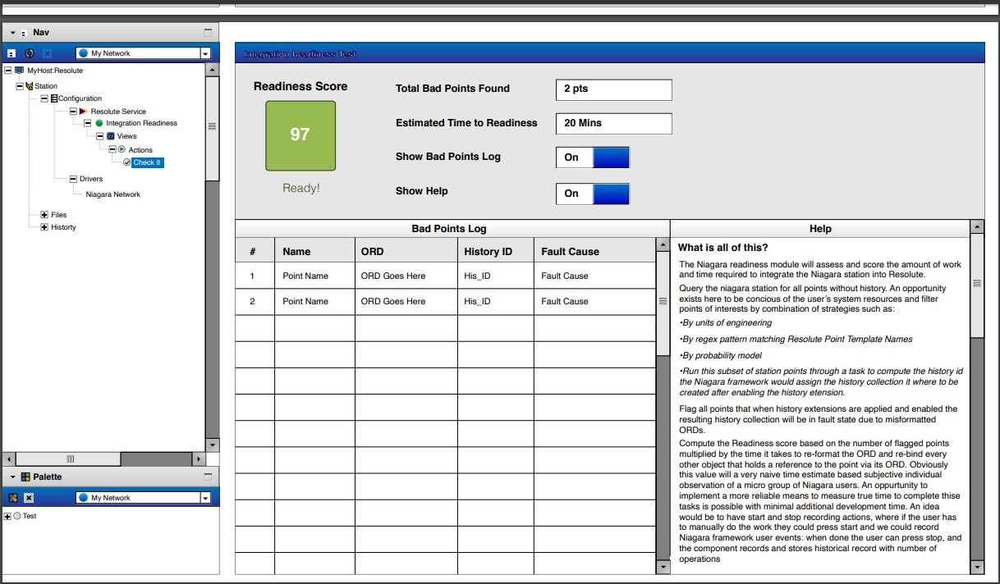

# User Story
[back to README](README.md)
1. Log into the Niagara station, filter modules in the palette search screen
   by 'ResoluteReadiness', find the ResoluteReadiness Niagara component, drag it and drop it
    under config.
2. Right-click the newly added component in the nav tree and click on the 'check-it' action to 
   generate score, state, and a log about the readiness of the niagara station for integration, 
   and the points that need to be fixed.
3. Double-left click the ResoluteReadiness Niagara component to display the UI, from the top right
   corner you can select the 'views' drop-down menu and go to the Property sheet to see a Niagara
   native GUI of the station model components of the ResoluteReadiness module which get loaded into
   the Workbench view.
   
   